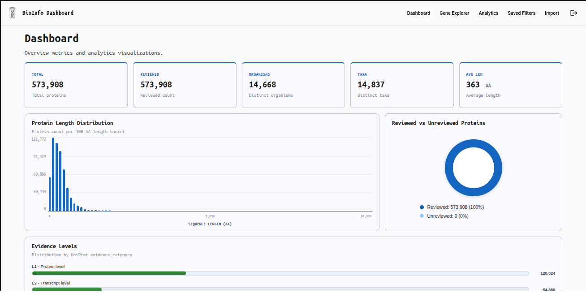
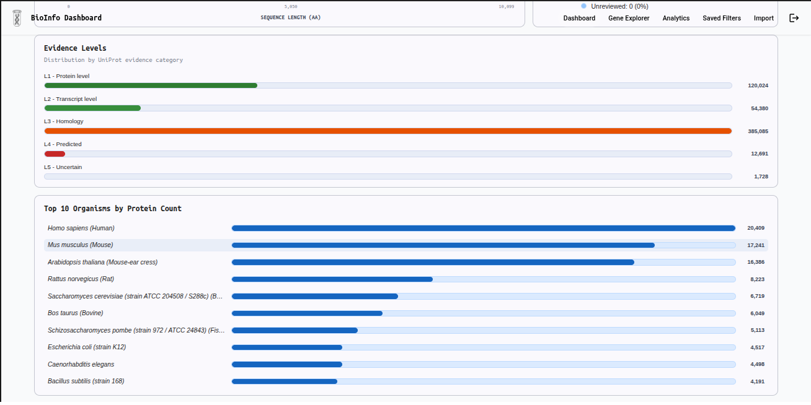
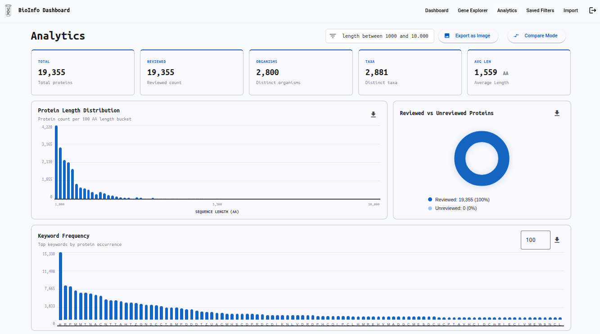
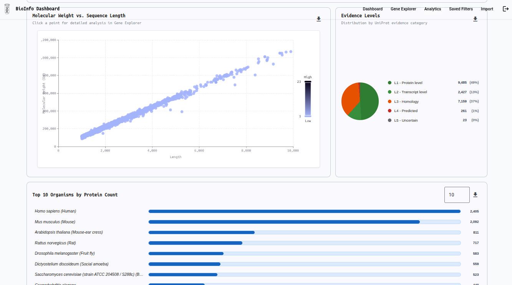
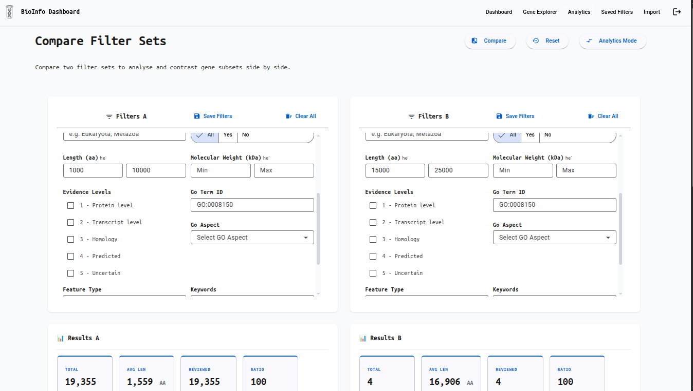
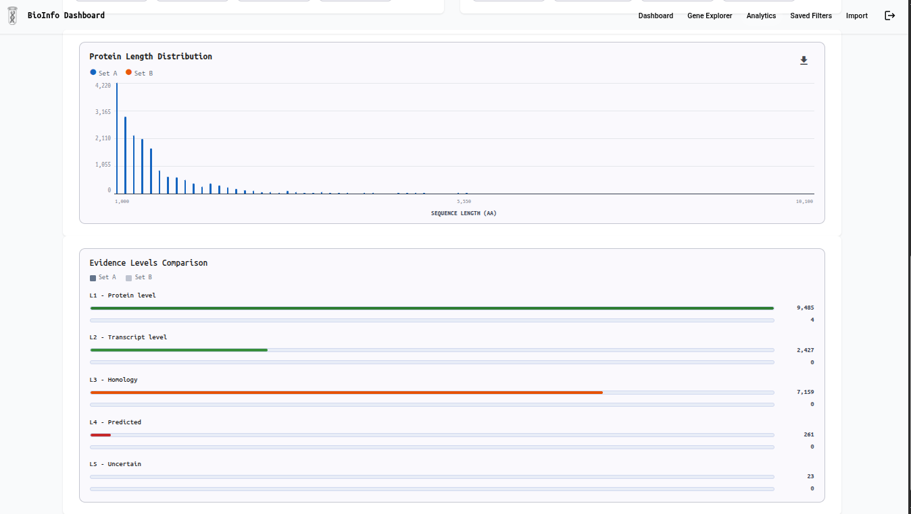

# Bioinformatics Analytics Dashboard

> **v2.0** — Explore, visualize, and analyze **UniProt protein/gene data** from both **remote UniProt.org API** (150M+
> entries)
> and **local database** (570K+ entries). Filter, import, visualize, and export — all in one unified platform.
> Built with **Angular 21**, **Spring Boot 4**, and **PostgreSQL 16**.
---

## ✨ What It Does

|                                                                                                |                                                                                              |
|------------------------------------------------------------------------------------------------|----------------------------------------------------------------------------------------------|
| 🌐 **Remote Explore** 150+ million UniProt proteins directly from UniProt.org API              | 📊 **Visualize** protein distributions via histograms, bar charts, pie charts, and KPI cards |
| 🔬 **Local Explore** 570K+ imported UniProt entries with advanced multi-field search & filters | 📥 **Import** remote data into local PostgreSQL with live progress tracking                  |
| 💾 **Export** filtered results (local or remote) as RFC 4180 CSV                               | 🔖 **Save** and reload filter combinations across sessions                                   |
| 🌙 **Dark Mode** Full dark theme support for comfortable extended exploration                  | 🔐 **Update Password** Secure user profile management with password reset                    |
| 📋 **Inspect** full protein detail: sequence, GO terms, features, cross-references             | ⚡ **Filter Remote Data** Apply 15+ filter dimensions to 150M UniProt entries in real-time   |

---

## 📸 Screenshots

### Login


### Gene Explorer — Search & Browse


### Advanced Filters


### Protein Detail


### Import Admin — Progress Monitoring


### Dashboard




### Analytics




### Compare




---

## 🚀 Quick Start
```bash
# Clone and configure
git clone <repo-url>
cd bioinformatics-analytics-dashboard
cp .env.example .env   # fill in DB credentials + JWT secret + UniProt API base URL
# Start everything with Docker
docker compose up --build
# → Frontend: http://localhost
# → Backend API: http://localhost/api
```

**Local development** (without Docker):
```bash
# Start PostgreSQL, then:
cd backend  && ./mvnw spring-boot:run          # http://localhost:8080
cd frontend && npm install && npm start        # http://localhost:4200
```

**Test accounts** (local only):
| Username | Password | Role |
|---|---|---|
| `user_test` | `password` | User |
| `admin_test` | `admin123` | Admin |

---

## 🔄 Dual-Mode Data Exploration

### Remote Mode (UniProt.org API)

- **150M+ live protein entries** from UniProt.org
- **Real-time filtering** on 15+ dimensions (accession, organism, GO terms, length, etc.)
- **No local storage required** — query remote API directly
- **Fast read-only access** for discovery and analysis

### Local Mode (PostgreSQL)

- **Import remote data** into local database for persistence
- **Materialized views** for instant analytics and KPI dashboards
- **Full-text search** on sequence, description, and keywords
- **Batch processing** with 570K+ entries for heavy lifting

---

## 🛠 Tech Stack

| Layer    | Technology                                                               |
|----------|--------------------------------------------------------------------------|
| Frontend | Angular 21 — signals, standalone components, AG Grid, ECharts, dark mode |
| Backend  | Spring Boot 4, Java 25 — layered REST API, Spring Batch, UniProt proxy   |
| Database | PostgreSQL 16 — materialized views, GIN indexes, full-text search        |
| APIs     | UniProt REST API integration for live 150M+ protein dataset              |
| Auth     | Spring Security + JWT (HS256), password management                       |
| Infra    | Docker Compose, Flyway migrations, nginx, Redis caching                  |
---

## 📁 Project Structure

```
backend/       → Spring Boot (controller → service → repository → dto)
frontend/      → Angular features: dashboard, genes, analytics, import-admin, auth
documentation/ → Specs: api-contract, domain-model, validation-rules, overview
devops/        → Dockerfiles, nginx config, shell scripts
```

Full details in [`documentation/`](documentation/).
---

## ⚡ Performance Targets

| Operation                      | Target      |
|--------------------------------|-------------|
| Remote UniProt API search      | ≤ 3 s (p95) |
| Local gene list load           | ≤ 1 s (p95) |
| Local filtered search          | ≤ 2 s (p95) |
| Dashboard KPIs                 | ≤ 500 ms    |
| CSV export (up to 100K rows)   | ≤ 5 s       |
| Remote data import to local DB | Streaming   |
| Full Swiss-Prot import         | No timeout  |

---

## 🎯 v2.0 Key Features

### Remote Data Access

- **Live UniProt.org integration** — access 150+ million protein entries without local storage
- **Advanced filtering** — search by accession, organism, protein length, GO terms, reviewed status, and more
- **Pagination & sorting** — handle large result sets efficiently
- **Caching layer** — optimized API queries with Redis

### Local Import & Visualization

- **Selective import** — cherry-pick filtered results from UniProt and import into local PostgreSQL
- **Batch processing** — handle millions of records with Spring Batch
- **Real-time progress** — live import tracking with cancel support
- **Materialized views** — pre-aggregated analytics for instant dashboard KPIs

### User Experience

- **🌙 Dark Mode** — full UI theme toggle for comfortable nighttime browsing
- **🔐 Password Management** — secure profile updates and password reset workflows
- **💾 CSV Export** — download filtered datasets (up to 100K rows) in RFC 4180 CSV format
- **📌 Saved Filters** — persist and reload custom filter combinations for repeated queries
- **Responsive design** — works seamlessly on desktop, tablet, and mobile devices

---

## 🤝 Contributing

1. Read [`documentation/constitution.md`](documentation/constitution.md) for coding standards.
2. Check [`documentation/api-contract.md`](documentation/api-contract.md) before touching any endpoint.
3. Every PR needs passing tests (`./mvnw test` + `npm test`).
4. Database changes go in a new Flyway migration — never edit existing scripts.
