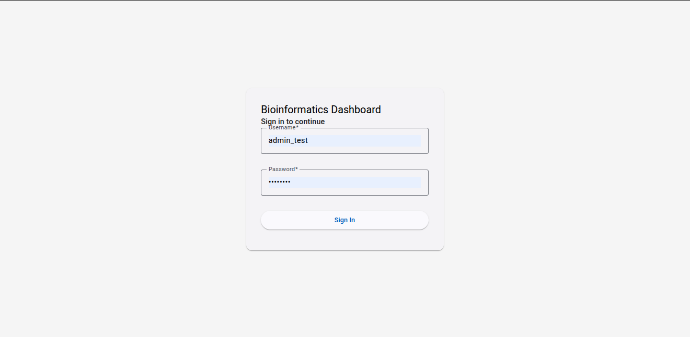
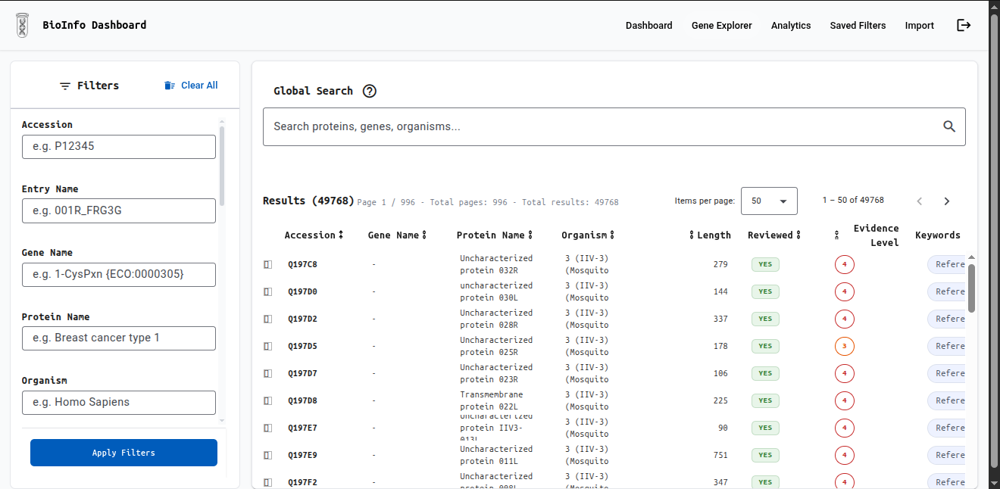
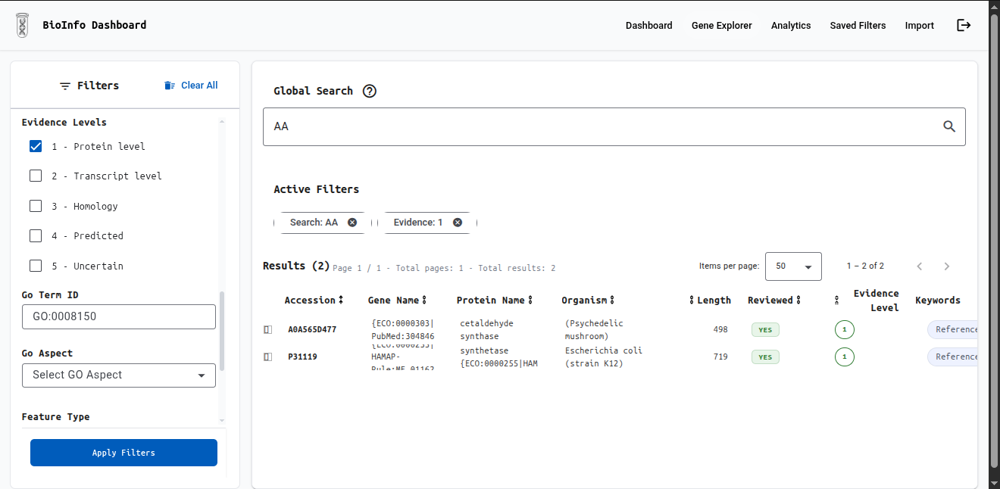
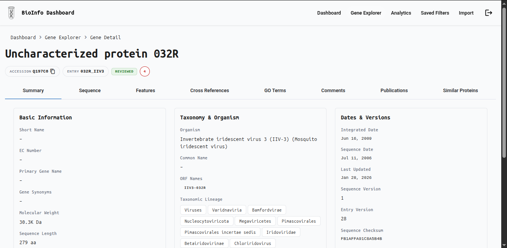
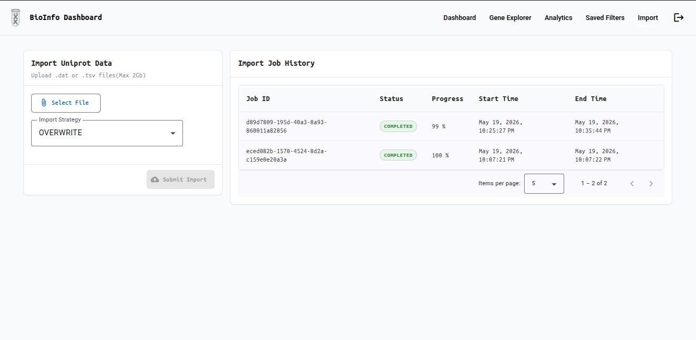

# Bioinformatics Analytics Dashboard

> Explore, visualize, and analyze **UniProt protein/gene data** — from raw `.dat` import to interactive charts, all in
> one platform.
> Built with **Angular 21**, **Spring Boot 4**, and **PostgreSQL 16**.
---

## ✨ What It Does

|                                                                                      |                                                                                              |
|--------------------------------------------------------------------------------------|----------------------------------------------------------------------------------------------|
| 🔬 **Explore** 570K+ UniProt protein entries with multi-field search and filters     | 📊 **Visualize** protein distributions via histograms, bar charts, pie charts, and KPI cards |
| 📥 **Import** UniProt `.dat` / `.tsv` files (up to 2 GB) with live progress tracking | 📋 **Inspect** full protein detail: sequence, GO terms, features, cross-references           |
| 💾 **Export** filtered results as CSV                                                | 🔖 **Save** and reload filter combinations across sessions                                   |

---

## 📸 Screenshots

### Login



### Gene Explorer — Search & Browse



### Advanced Filters



### Protein Detail



### Import Admin — Progress Monitoring


---

## 🚀 Quick Start
```bash
# Clone and configure
git clone <repo-url>
cd bioinformatics-analytics-dashboard
cp .env.example .env   # fill in DB credentials + JWT secret
# Start everything with Docker
docker compose up --build
# → Frontend: http://localhost
# → Backend API: http://localhost/api
```

**Local development** (without Docker):
```bash
# Start PostgreSQL, then:
cd backend  && ./mvnw spring-boot:run          # http://localhost:8080
cd frontend && npm install && npm start        # http://localhost:4200
```

**Test accounts** (local only):
| Username | Password | Role |
|---|---|---|
| `user_test` | `password` | User |
| `admin_test` | `admin123` | Admin |
---

## 🛠 Tech Stack

| Layer    | Technology                                                        |
|----------|-------------------------------------------------------------------|
| Frontend | Angular 21 — signals, standalone components, AG Grid, ECharts     |
| Backend  | Spring Boot 4, Java 25 — layered REST API, Spring Batch import    |
| Database | PostgreSQL 16 — materialized views, GIN indexes, full-text search |
| Auth     | Spring Security + JWT (HS256)                                     |
| Infra    | Docker Compose, Flyway migrations, nginx                          |
---

## 📁 Project Structure

```
backend/       → Spring Boot (controller → service → repository → dto)
frontend/      → Angular features: dashboard, genes, analytics, import-admin, auth
documentation/ → Specs: api-contract, domain-model, validation-rules, overview
devops/        → Dockerfiles, nginx config, shell scripts
```

Full details in [`documentation/`](documentation/).
---

## ⚡ Performance Targets

| Operation              | Target      |
|------------------------|-------------|
| Gene list load         | ≤ 1 s (p95) |
| Filtered search        | ≤ 2 s (p95) |
| Dashboard KPIs         | ≤ 500 ms    |
| CSV export (10K rows)  | ≤ 5 s       |
| Full Swiss-Prot import | No timeout  |
---

## 🤝 Contributing

1. Read [`documentation/constitution.md`](documentation/constitution.md) for coding standards.
2. Check [`documentation/api-contract.md`](documentation/api-contract.md) before touching any endpoint.
3. Every PR needs passing tests (`./mvnw test` + `npm test`).
4. Database changes go in a new Flyway migration — never edit existing scripts.
